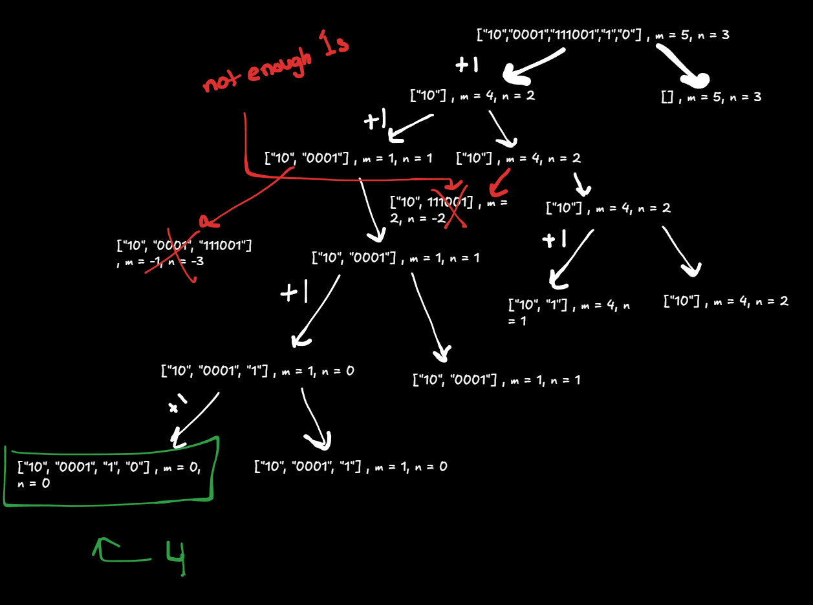
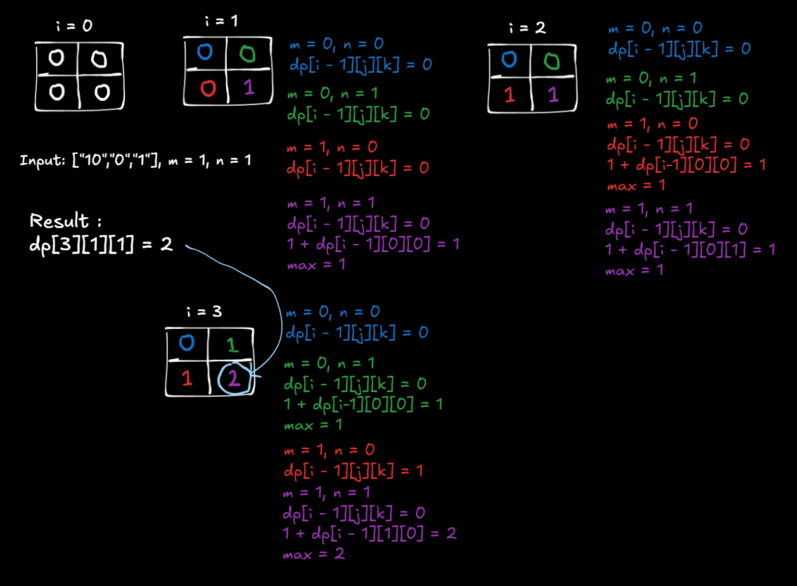

**Problem Link:** https://leetcode.com/problems/ones-and-zeroes/

## Thought Process
- We need to make a decision to include the current string or not include the string
- We try every combination of including / not including, and find the longest possible subset
- Our base case would be if the index is out of range, since we know we exhausted all options 
- For each string / item in the array, we count the number of zeros and the number of ones
- We first get the longest possible subset if we don't include the current item
- If m and n are greater than the number of zeros and number of ones respectively, we get the longest possible subset with including the current string. We would also add one to it, since the current string is part of the subset
- We then compare which decision resulted in a bigger subset and return that value
- We employ memoization to remove repeated work, our key would be the index, the amount of zeros, and the amount of ones as a tuple. The value would represent the longest possible subset with these numbers.  
- Walkthrough: 

## Bottom Up Approach
- At every string, we go through every number up to m and n and save that into our 3D table
- Essentially, 3 nested for loops
- The inner nested for loops with m and n represent all the possible 1s and 0s left
- When we have the number of 0s AND number of 1s greater than or equal to a given m and n (respectively) combination, we can include that string and add 1 to the value in the previous iteration, in the position that represents the number of strings you can include with that specific m and n combination. 
- Walkthrough 