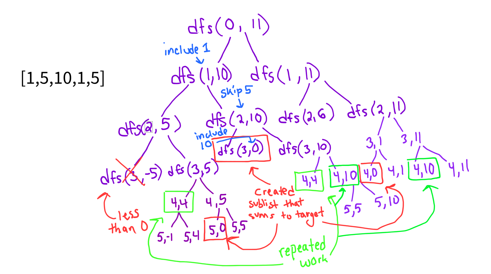
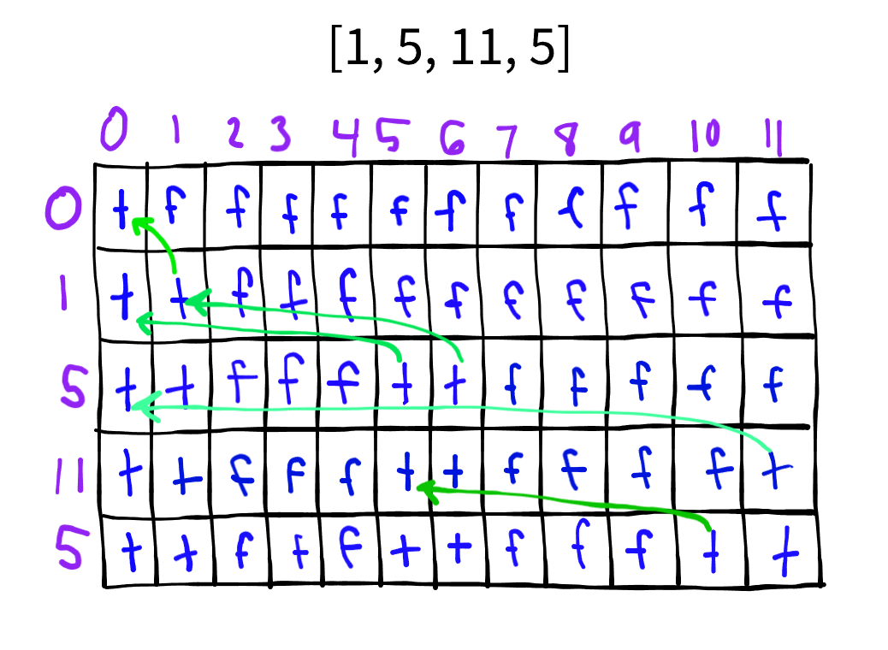

**Problem Link:** https://leetcode.com/problems/partition-equal-subset-sum/description/

## Neetcode

### Generating Ideas
- We notice that we're essentially looking to find any given sub-list that add up to total sum divided by two since the problem statement is to see if there are two partitioned sublists with sums that equal each other and if we can find sublist that adds up to half the sum, that means the other half exists else where. 
- If the sum of the entire list is odd, then we return False since it's impossible to partition 

### Brute Force Solution
- Go through each number in nums and make two decisions
    - include current number in sum
    - skip current number
- Time complexity is 2^n due to branching twice for each number and the height of the tree is n, where n is the size of the input list
- Look for repeated work to cut down on
- Space complexity is O(n)

### Example
Input: nums = [1,5,10,1,5]  
Output: true

### Optimization
- We notice repeated work aka we reach another recursive call where we re-compute the same target and index
- our dp needs to be of size target by index
- Time complexity is O(n * target)
- Space complexity is O(n * target)

### Tabulation (bottom-up)
- Each cell represents if we can make the target j with all items until the ith index in nums
- If the value in the previous row is true, it means we were already able to make the target with the values we had
- If we use the difference between the current target and current item in the list as an index (assuming current target is greater than current item), and if the value in the previous row at that index is true, it means we are able to create a sum for that target using our current value. 
- Our table allows us to assume that for any given cell in the previous rows , if the value is true it means we were able to use all previous items to sum up to that target
- Time complexity is O(n * target)
- Space complexity is O(n * target)

### Example
Input: nums = [1,5,11,5]  
Output: true  

### Tabulation with Space Optimization
- We're only ever looking at the previous row, so that's the only thing we'd have to update after each in the outer loop

