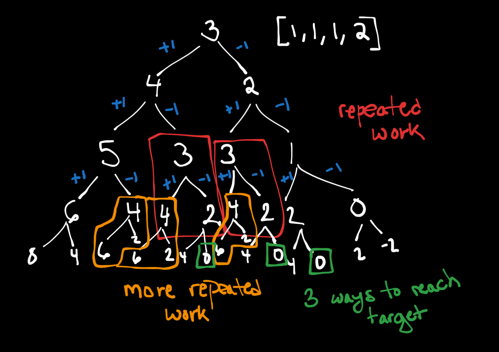

**Problem Link: https://leetcode.com/problems/target-sum/**

## My Thought Process
- At each number (n) in the list, we need to make a decision to either add n or subtract n from our current sum
- Similar to the partition sum, we're making all possible combinations of our decisions with all numbers until and including n and then counting the number of times we see our target
- We use previous to represent all possible combinations with the previous values, adding or subtracting the current number to these values will then give you all the possible sum (inductive hypothesis) 
- Unlike partition sum, we don't return once we've found the target since we want to know the number of ways to reach target. Hence you can't do this with just a set, since we want multiple values of the target - set contains no duplicates. 
- Doing the combinations with the list makes it possible to get all possible sums with duplicates. However this becomes 2^n run time.
- The problem is we still want to track the duplicates but don't want to do the computation / find combination for the duplicate multiple times
- The solution is then to, instead of using a list, use a hashmap and keep track of the number of ways we reached a given sum. Whenever we reach a sum, we simply add  the current number of ways for that sum (if it's new sum, current number of ways would be 0) and all the ways to reach the sum before adding/subtracting. 
### Example:
[1, 1, 1] <- input  
We start with {0: 1} because there's exactly one possible way to get this sum (basically since it's the start, there will always be one possible way to get here)  

On our first iteration, we are essentially looking at all possible sums with just [1]  
0 + 1 = 1  
0 - 1 = -1  
Which leaves us with the following at the end of this iteration  
{1 : 1, -1 : 1}  

On to the second iteration, we are now looking at all possible sums with [1, 1]  
We know that with just [1], we can make either possitive 1 or -1. So adding 1 or -1 (aka our current value) to each gives us all possible sums.  
1 - 1 = 0  
1 + 1 = 2  
-1 + 1 = 0  
-1 - 1 = -2  
Which leaves us with the following at the end of this iteration  
{2: 1, 0: 2, -2 : 1}  

If you think about that for a second it makes sense. There is only 1 way to reach either 2 or -2, which is the case where both values are either -1 or +1  
There are two ways to reach 0, we pretty much alternate +1 and -1.  
A possible question is why is that we forget about the 1 or -1 or the 0 we had initially? 
like we had {1 : 1, -1 : 1}, and {0: 1}.  
Answer: Those are no longer possibilities when we add our current value. We can't choose to ignore that value. We can always either add or subtract any given value. If we kept the previous sums, it would mean we can ignore the current value in the iteration.  

On the third iteration, we are now looking at all possible sums with [1, 1, 1]  
For this one, I'll highlight how the hashmap changes  
2 + 1 = 3  
{3: 1}  
2 - 1 = 1  
{1: 1, 3: 1}  
-2 + 1 = -1  
{1: 1, 3: 1, -1: 1}  
-2 - 1 = -3  
{1: 1, 3: 1, -1: 1, -3: 1}  
0 + 1 = 1  
{1: 3, 3: 1, -1: 1, -3: 1}  
0 - 1 = -1  
{1: 3, 3: 1, -1: 3, -3: 1}  
Which leaves us with the following at the end of the iteration:  
{1: 3, 3: 1, -1: 3, -3: 1}  

If you noticed, when we did 0 + 1 and 0 - 1, the number of ways to reach 1 or -1 went from 1 to 3.  
This is because there are 2 possible ways to get to 0 with just [1, 1]. Adding the next value ([1, 1, 1]) means there should be 2 possible ways to get to that value as well aka +1 -1 +1 and -1 +1 +1 (same applies to subtracting the next value)  

## Top Down Memoization Solution

- Typically in top down approaches, we start with the value we want, in our case target, and work our way downwards. 
- We know we have two states to check, the index to represent the current value in the array and a possible sum for values until that index.
- We're making two decisions, to either add the current value or to subtract the current value
- Our base case should be if we've gone through the whole list (nums) and if we saw the same state again.
- Drawing out the tree should help us see that , a state would be represented not just by the value but also the index.
- Walkthrough: 
- What does each value represent on the tree? It means we're finding the number of ways to get that value after exhausting all items in our nums list.
- For instance, we have the value 2 and the last item in the list is also 2, that means there's one way to reach 2 (which is to subtract the item aka 2)
- Hence, the number in root is obviously our target but the return value will be the number of ways to get there since we're adding the first item or subtracting the first item, and then the question becomes what are the possible ways to reach those values with the rest of the list, and so on. 
- Highlighted in orange, we notice that the same "target" appears multiple times in the same level. Additionally, in the red, we can see that the orange appears in it , and the red is also repeated. 
- If we get the same value at the same level , it means we already know how many ways we can get to that value using all the possible items. Hence we know that , in our memoization, we would save the level (aka number of items we exhausted or index) and the value (current target) as the key. If we just did the current target, that would be incorrect because it doesn't take into consideration how many items in the list we used to get that target. 