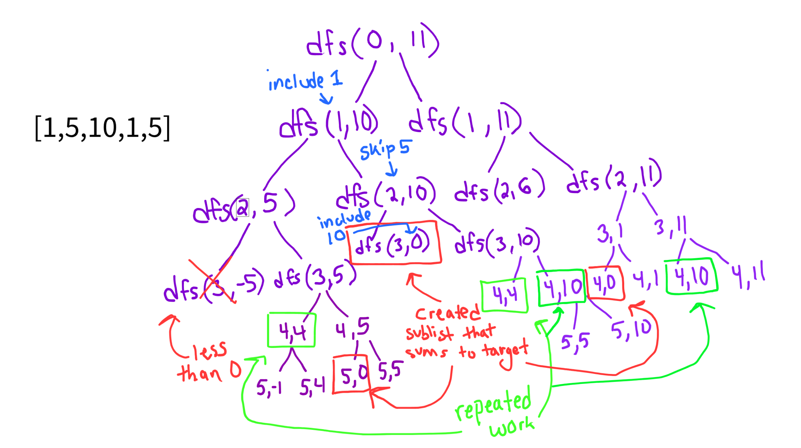

**Problem Link:** https://leetcode.com/problems/partition-equal-subset-sum/description/

## Neetcode

### Generating Ideas
- We notice that we're essentially looking to find any given sub-list that add up to total sum divided by two since the problem statement is to see if there are two partitioned sublists with sums that equal each other and if we can find sublist that adds up to half the sum, that means the other half exists else where. 
- If the sum of the entire list is odd, then we return False since it's impossible to partition 

### Brute Force Solution
- Go through each number in nums and make two decisions
    - include current number in sum
    - skip current number
- Time complexity is 2^n due to branching twice for each number and the height of the tree is n, where n is the size of the input list
- Look for repeated work to cut down on

### Example
Input: nums = [1,5,10,1,5]  
Output: true

### Optimization
- We notice repeated work aka we reach another recursive call where we re-compute the same target and index
- our dp needs to be of size target by index
